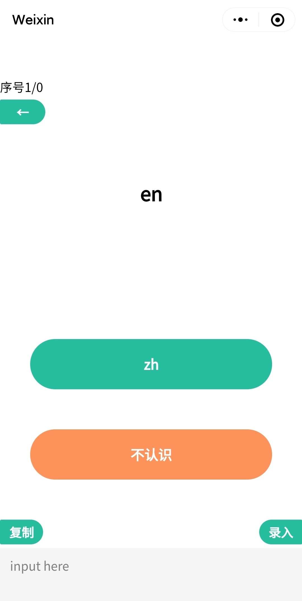

# Recite Words：背单词的微信小程序

> 考研时候自己写的英语背单词的微信小程序。

## 使用

 <p>
    
</p>


- 从记事本或任何地方复制单词列表，格式如下（每行之间回车，英文和中文用空格隔开），点击录入即可将单词切分开后随机依次显示

- ```
  optimistic a.乐观主义的
  litter n.垃圾,(杂乱的)废物
  relish n.美味,味道,调味品,食欲,乐趣
  due a.(to)应支付的;(车,船等)预定应到达的
  acre n.英亩；田地；地产
  ultraviolet a./n.紫外线(的)
  floor n.地板,(楼房)的层
  ```

- 认识的单词点绿色，不认识的点黄色标记下来

- 下方会记录所有标记的单词，点击复制即可将对应的单词写入剪贴板，可以再点击录入只背这部分不认识的单词，或者粘贴到记事本中到下次直接使用。

